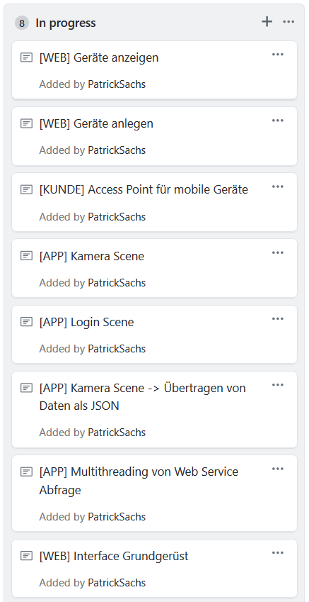
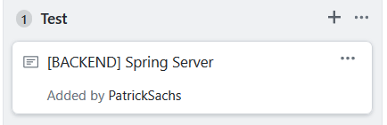
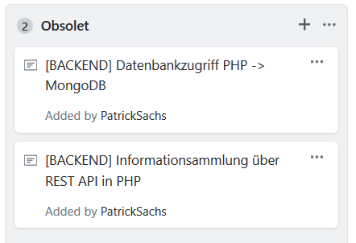

# Sprint 7

* Datum: 23.05.2019
* Backend Team hat Technologie von PHP auf Java gewechselt
* JSON Format wurde spezifiert: [Siehe hier](./daten)

## In Arbeit

## Im Test

## Obsolet geworden

## Zurück

[Zurück zur Übersicht](./..)
